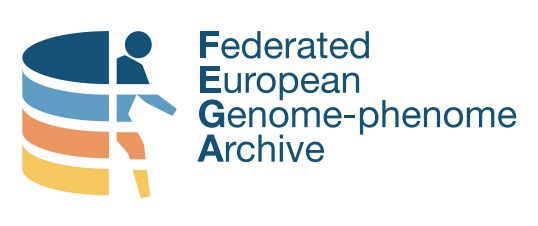

# Establishing a Federated EGA Node

**This readme is a placeholder for draft content before we set up the real repository on EGA-archive and organise it to render a useful website, like how the [Galaxy Training Network](https://github.com/galaxyproject/training-material) does it.**

Welcome to this collection of onboarding materials for establishing a Federated EGA Node!

## What am I doing here?

If you areon this page, you are probably looking for information on how to join the Federated EGA Network. Great! There is a lot of information here for you.

These materials are a general guide for establishing a node in the Federated EGA Network. They are based on the knowledge and experiences of current nodes and their use cases. Your node's development might differ depending on your use cases and mandates from stakeholders. Please view these materials as suggestions and best practices - not hard requirements!

## Where do I start?

- Involved in **governance or legal aspects** of establishing a Federated EGA node? Start [here](#governance-and-legal-aspects-of-establishing-a-node)! 
  - For data protection officers, data stewards, policy makers, strategic decision makers, etc.
- Involved in **technical or operational aspects** of establishing a Federated EGA node? Start [here](#technical-and-operational-aspects-of-establishing-a-node)! 
  - For software developers and engineers, bioinformaticians, data stewards, support officers, etc.
- Involved in **outreach or training aspects** of establishing a Federated EGA node? Start [here](#outreach-and-training-aspects-of-establishing-a-node)! 
  - For data stewards, support officers, outreach/communications officers, etc.

**Links are broken - should link to new pages with organised materials.**

## What does the journey look like?

Based on our experience, governance and legal development of a node usually happens in parallel with technical and operational development, followed by development of user-facing components once a node is minimally operating. You may find your path differs slightly for a variety of reasons - that's ok! 

These materials guide you through onboarding information from the experiences of other nodes. Take what you find useful to apply to your own node development.

There is no time limit on establishing your Federated EGA node. Onboarding will take more or less time depending on things like existing infrastructure and governance models, availability of funding and resources, and user needs.

## Usage

The content of the material is developed collaboratively in shared Google documents and Markdown. A templating system ([Jekyll](http://jekyllrb.com/)) is used to format the onboarding materials and generate a website (**TBD**).

If you want to build the website locally, please have a look at this tutorial (**TBD**).

## License

The content of the FEGA onboarding materials and website are licensed under the [Creative Commons Attribution Share Alike 4.0 International License](https://creativecommons.org/licenses/by-sa/4.0/).

## Contributing

Please see our [contributing guide](CONTRIBUTING.md) for information on how to contribute to the generation and maintenace of these materials. Thank you in advance for your contributions!

## Acknowledgements

We would like to thank all contributors, especially those mentioned in the [Contributors list](CONTRIBUTORS.yaml), the Federated EGA community for their support, and our funding partners (**To be listed somewhere**).

