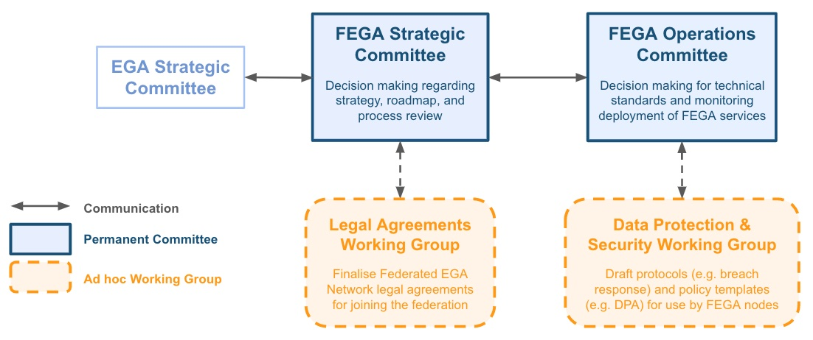
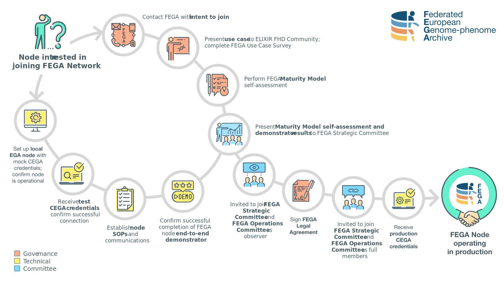

# Governance and Legal

Welcome! If you are involved in governance or legal aspects of establishing a Federated EGA node, you are in the right place. The information here covers topics related - but not limited - to Federated EGA node governance, strategic planning, sustainability, and legal.

**You might find this page useful if you are:**
- a team or node lead
- a grant writer
- a project manager or coordinator
- a lawyer or legal expert
- a data protection officer (DPO)

**By exploring these materials, you will be able to:**
- Understand the aims of the Federated EGA
- Understand the role of Committees and Working Groups within the Federated EGA
- Evaluate the roles and responsibilities of your node within the Federated EGA
- Make use of examples and templates to define your node's governance and legal policies

## 1. Understand governance structure

### Vision

**The Federated EGA is the primary global resource for discovery and access of sensitive human omics and associated data consented for secondary use, through a network of national human data repositories to accelerate disease research and improve human health.**

Over the last 10 years, most individual-level human omics data have been generated in the context of research consortia and shared via global repositories such as the European Genome-phenome Archive (EGA). Many countries now have emerging personalized medicine programmes which are generating data from national or regional initiatives. Thus, human genomics is undergoing a step change from being a research-driven activity to one funded through healthcare initiatives.

Genetic data generated in a healthcare context is subject to more stringent information governance than research data and often must comply with national legislation. To address this need, the Federated EGA provides a network of connected resources to enable transnational discovery of and access to human data for research while also respecting jurisdictional data protection regulations. By providing a solution to emerging challenges around secure and efficient management of human omics and associated data, the Federated EGA fosters data reuse, enables reproducibility, and accelerates biomedical research.

### Use cases

Understand more about the current <a href="https://zenodo.org/record/4893063" target="_blank">use cases and architecture for Federated EGA</a>. Here you can read about the requirements and national use cases of early engaged Federated EGA Nodes which aim to be addressed by joining the Federated EGA. The report also describes how specific use cases can be supported by Federated EGA, for example by a governance structure made up of permanent committees and ad hoc working groups, the use of global and community standards, and guidelines for how data/metadata can be shared within the network. 

### Organisation

Here is described the <a href="https://ega-archive.org/files/EGA-Federation-Structure-v1.1.pdf" target="_blank">Federated EGA Structure and Organisation</a>. Federated EGA is broadly organised into two main types of nodes: Central EGA nodes (maintained by EMBL-EBI and CRG) and Federated EGA nodes (maintained at national or regional levels). Read the document linked above to learn more about the roles and responsibilities of each type of node.

Federated EGA is governed by two permanent committees:
- The **Federated EGA Strategic Committee** <a href="https://ega-archive.org/files/ToR-Federated-EGA-Strategic-Committee-v1.1.pdf" target="_blank">(Terms of Reference)</a> provides direction and strategic planning for the Federated EGA. The Committee receives input from the Central EGA Strategic Committee and provides feedback for the EGA strategic roadmap.
- The **Federated EGA Operations Committee** <a href="https://ega-archive.org/files/ToR-Federated-EGA-Operations-Committee-v1.1.pdf" target="_blank">(Terms of Reference)</a> reviews operational performance and coordinates technical implementation roadmaps of the Federated EGA. The Committee receives advice from and provides operational reporting to the Federated EGA Strategic Committee.

Additional **Federated EGA Working Groups** are established, as needed. Working groups can be initiated from either of the Committee.

## 2. Implement legal frameworks

### FEGA Collaboration Agreement

Inclusion in the Federated EGA is codified by signing of the <a href="https://drive.google.com/file/d/1QAKABRB5ZxAJlQSwFHaJ3e6TdtwZaCYs/view" target="_blank">**Federated EGA Collaboration Agreement**</a> (CA) between Central EGA (represented by the European Molecular Biology Laboratory and Fundació Centre De Regulació Genòmica) and the Federated EGA node. Nodes are welcome to make a copy of this current version of the CA to start its review with their legal teams and understand the responsibilities of joining FEGA. Nevertheless, this version (the one with a watermark) shall not be signed: the official version needs to be obtained from FEGA prior signing through its official channels. 

### Data Processing Agreement (DPA)

As Central EGA is a Data Processor under GDPR definitions, all data submitters are required to agree to and sign the <a href="https://ega-archive.org/files/EGA_Data_Processing_Agreement_v1.1.pdf" target="_blank">EGA Data Processing Agreement</a>. Federated EGA nodes also acting as Data Processors will require a similar agreement outline the roles and responsibilities of Data Processors, Data Controllers, and Data Requestors.

### Data Protection and Impact Analysis (DPIA)

Coming soon!

## 3. Complete steps to join Federated EGA

The pathway to becoming a Federated EGA node includes governance/legal steps (red, top-right path) that must be completed:

* **Contact FEGA with intent to join**. This step can be accomplished by engaging in the ELIXIR FHD Community ("[How do I start?](../../#how-do-i-start)") or by contacting Mallory Freeberg or Amy Curwin.
* **Present use cases to ELIXIR FHD Community; Complete FEGA Use Case Survey**. Nodes are encouraged to present at an ELIXIR FHD Community Call on topics related to: 1) national use cases for managing sensitive human omics, phenotype, and clinical data; 2) current challenges for managing sensitive human data; 3) solutions/initiatives planned or in progress to meet these challenges; and 4) how Federated EGA fits in to the node's overall goals. Some examples of previous presentations from nodes:
  * <a href="https://drive.google.com/file/d/1qZ4YqlKwCuerIcjSfijUGhvaVQy8iMWf/view?usp=sharing" target="_blank">Canada</a>
  * <a href="https://docs.google.com/presentation/d/1mpTQhBt69reQz3Viju3EWPSi50sdfFy6rBO__gyznK8/edit?usp=sharing" target="_blank">Germany</a>
  * <a href="https://drive.google.com/file/d/1Zl6KrKefo2bxV6czTmct7XJYMSX2PP7j/view?usp=sharing" target="_blank">Norway</a>
  * <a href="https://docs.google.com/presentation/d/1GC65umfBmeNH2T6eFGlJwsPe4JajBKIpirAtkEXj2Fc/edit?invite=CLT52HQ#slide=id.p1" target="_blank">Portugal</a>
  * <a href="https://docs.google.com/presentation/d/1f9OcWKrOeYbkk-zLjhsAR6A13gH1_Ao9hEimXWO49vc/edit?usp=sharing" target="_blank">Romania</a>
  * <a href="https://docs.google.com/presentation/d/10ykS6GO5P4VprVIPiE95ze00qLrjv6BwsvWFsPom_CA/edit?usp=sharing" target="_blank">Slovenia</a>
  * <a href="https://drive.google.com/file/d/1QPqO_4-5utYt6G761KdPSMT7uOzMllxn/view?usp=sharing" target="_blank">Switzerland</a>
  * <a href="https://drive.google.com/file/d/1PzcC--fCTJ75sPVjOfemxwN2PkWisGIZ/view?usp=sharing" target="_blank">Sweden</a>
* **Perform FEGA Maturity Model self-assessment**. This step can be accomplished by [evaluating your node against the Maturity Model](../maturity-model/#2-evaluate-against-the-fega-maturity-model).
* **Sign FEGA Legal Agreement**. Also called the "FEGA Collaboration Agreement", this is the final step to official join the Federated EGA. 

## 4. Explore additional resources

- More about <a href="https://gdpr-info.eu/" target="_blank">EU GDPR</a>
- Training materials developed by ELIXIR-Luxembourg on <a href="https://zenodo.org/record/5078280#.YrxoEOxKjjD" target="_blank">data protection in biomedical research</a>

## 5. What's next?

Coming soon!
